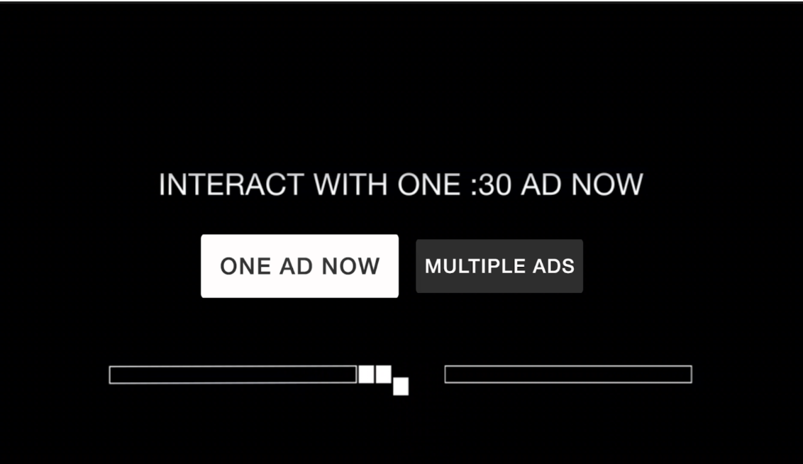

#TruexAdRenderer tvOS Documentation

Version 3.5.0

## Contents

* [Overview](#overview)
* [Product Flows](#product-flows)
* [How to use TruexAdRenderer](#how-to-use-truexadrenderer)
    * [When to show True\[X\]](#when-to-show-truex)
    * [Handling Events from TruexAdRenderer](#handling-events-from-truexadrenderer)
    * [Handling Ad Elimination](#handling-ad-elimination)
* [TruexAdRenderer tvOS API](#truexadrenderer-tvos-api)
    * [TruexAdRenderer Methods](#truexadrenderer-methods)
        * [initWithUrl](#initwithurl)
        * [start](#start)
        * [stop](#stop)
        * [pause](#pause)
        * [resume](#resume)
    * [TruexAdRendererDelegate methods](#truexadrendererdelegate-methods)
        * [onAdStarted](#onadstarted)
        * [onAdCompleted](#onadcompleted)
        * [onAdError](#onaderror)
        * [onNoAdsAvailable](#onnoadsavailable)
        * [onAdFreePod](#onadfreepod)
        * [onOptIn (optional)](#onoptin-optional)
        * [onOptOut (optional)](#onoptout-optional) 
        * [onSkipCardShown (optional)](#onskipcardshown-optional) 
        * [onUserCancel (optional)](#onusercancel-optional) 
        * [onUserCancelStream (optional)](#onusercancelstream-optional) 
    * [TruexAdRenderer Constants](#truexadrenderer-constants)
        * [MIDROLL](#midroll)
        * [PREROLL](#preroll)

## Overview

In order to support interactive ads on tvOS, TrueX has created a renderer library that can renderer TrueX ads natively, while still leveraging the same VPAID architecture available in Uplynk and FreeWheel.

With this library, the host player app can defer to the TruexAdRenderer when it is required to display a TrueX ad.

For simplicity, publisher implemented code will be referred to as "app code" while TrueX implemented code will be referred to as "renderer code".

TrueX will provide an Objective-C `TruexAdRenderer` library that can be loaded into the app. This library will offer a class, `TruexAdRenderer`, that will need to be instantiated, initialized and given certain commands (described below in [TruexAdRenderer Methods](#truexadrenderer-methods)) by the app code. It will also contain a singleton of shared constants, `TruexConstants`.

At this point, the renderer code will take on the responsibility of requesting ads from TrueX server, creating the native UI for the TrueX choice card and interactive ad unit, as well as communicating events to the app code when action is required.

The app code will still need to parse out the Uplynk ad response, detect when a TrueX ad is supposed to display, pause the stream, instantiate `TruexAdRenderer` and handle any events emitted by the renderer code. It will also need to call pause, resume and stop methods on the `TruexAdRenderer` when certain external events happen, like if the app is backgrounded or if the user has requested to exit the requested stream via back buttons.

It will also need to handle skipping ads in the current ad pod, if it is notified to do so.


## Product Flows

There are two distinct product flows supported by `TruexAdRenderer`: Sponsored Stream (full-stream ad-replacement) and Sponsored Ad Break (mid-roll ad-replacement).

In a Sponsored Ad Break flow, once the user hits a mid-roll break with a TrueX tag flighted, they will be shown a "choice-card" offering them the choice between watching a normal set of video ads or a fully interactive TrueX ad:



***Fig. A** example true\[X\] mid-roll choice card*

If the user opts for a normal ad break, or if the user does not make a selection before the 30 second countdown timer expires, the TrueX UI will close and playback of normal video ads can continue as usual.

If the user opts to interact with TrueX, an interactive ad unit will be shown to the user:


***Fig. B** example true\[X\] interactive ad unit*

The requirement for the user to "complete" this ad is for them to spend at least 30 seconds on the unit and for at least one interaction (tapping the Siri remote or navigating anywhere through the ad).

Once the user fulfills both requirements, a "Watch Your Show" button will appear in the bottom right, which the user can select to exit the TrueX ad. Having completed a TrueX ad, the user will be returned directly to content, skipping the remaining ads in the current ad pod.

The Sponsored Stream flow is quite similar. In this scenario, a user will be shown a choice-card in the pre-roll:


***Fig. C** example true\[X\] preroll choice card (full-stream replacement)*

Similarly, once if the user opts-in and completes the TrueX ad, they will be skipped over the remainder of the pre-roll ad break. However, every subsequent mid-roll break in the current stream will also be skipped over. In this case instead of the regular pod of video ads, the user will be shown a "hero card" (also known as a "skip card"):


***Fig. D** example true\[X\] mid-roll skip card*

This messaging will be displayed to the user for several seconds, after which they will be returned directly to content.


## How to use TruexAdRenderer 

When referring to data returned via Uplynk Preplay, I will reference this example JSON response in order to clearly explain which piece of data is required: 

```
    https://gist.github.com/jalbini/7c0f908064ae1468beb0e4a11fd187ec
```

I will refer to entire object as `response`, and will point to specific pieces of data using standard JSON notation. 


### When to show True\[X\]

Upon receiving an ad schedule from Uplynk, you should be able to detect whether or not TrueX is returned in any of the pods. TrueX ads should have `apiFramework` set to `VPAID`. 

In the example response, you will see those values at `response.ads.breaks[0].ads[0].apiFramework` and `response.ads.breaks[0].ads[0].creative` respectively.

The Uplynk PrePlay documentation will have more information on determining exactly when the VPAID ad unit should fire -- from what I've ascertained, you'd simply reference `response.ads.placeholderOffsets`, using `adIndex` and `breakIndex` to correlate them to each separate VPAID unit.

Once the player reaches a placeholder, it should pause, instantiate the `TruexAdRenderer` and immediately call `init()` followed by `start()`.

Alternatively, you can instantiate and `init()` the `TruexAdRenderer` in preparation for an upcoming placeholder. This will give the `TruexAdRenderer` more time to complete its initial ad request, and will help optimize TrueX load time. Once the player reaches a placeholder, it can call `start()` to notify the renderer that it can display the unit to the user.


### Handling Events from TruexAdRenderer

Once `start()` has been called on the renderer, it will start to emit events (a full list of events is available in [TruexAdRendererDelegate methods](#truexadrendererdelegate-methods))

One of the first events you will receive is `AD_STARTED`. This notifies the app that the renderer has received an ad for the user and has started to show the unit to the user. The app does not need to do anything in response, however it can use this event to facilitate a timeout. If an `AD_STARTED` event has not fired within a certain amount of time, the app can call `stop()` on the renderer and proceed to normal video ads. 

If there were no ads available to the user or if there was an error making the ad request, `NO_ADS_AVAILABLE` or `AD_ERROR` will fire respectively. At this point, the app should resume playback without skipping any ads, so the user receives a normal video ad payload.

Another important event to listen for is `AD_FREE_POD`. This signifies that the user has earned a credit with TrueX and, once the renderer signals it is complete, all linear video ads remaining in the current pod should be skipped. It's important to note that the player should not immediately resume playback once receiving this event -- rather it should note that it was fired and continue to wait for an `AD_COMPLETED` event.

The last major event to fire will be an `AD_COMPLETED` event. This will signal to the app that the renderer has finished showing the TrueX unit to the user. The user may have opted out of TrueX, let the choice card countdown expire, or may have completed a TrueX ad unit and earned an ad-free credit (an `AD_FREE_POD` event would have already been fired in the last case). At this point, the app should check if an `AD_FREE_POD` event has fired -- if so, the user should be fast-forwarded past all remaining linear video ads and playback should resume. If not, playback still should resume, but without fast-forwarding so the user receives the remaining payload of video ads.


### Handling Ad Elimination

Skipping video ads is completely the responsibility of the app code. The Uplynk Preplay API should provide enough information for the app to determine where the current pod end-point is, and, when appropriate, should fast-forward directly to this point when resuming playback.


## TruexAdRenderer tvOS API

This is an outline of public `TruexAdRenderer` methods and delegate methods (referred to as events). 


### TruexAdRenderer Methods

When referring to data returned via Uplynk Preplay, I will reference this example JSON response in order to clearly explain which piece of data is required: 

```
    https://gist.github.com/jalbini/79a6fcd4e12049b6f5ee1d883d372b81
```

I will refer to entire object as `response`, and will point to specific pieces of data using standard JSON notation. 


#### initWithUrl

    - (id)initWithUrl:(NSString *)creativeUrl adParameters:(NSDictionary*)adParameters slotType:(NSString *)slotType optimizelyProjectId:(NSString*)optimizelyProjectId optimizelyUserId:(NSString*)optimizelyUserId

This method will be called by the app code in order to instantiate the `TruexAdRenderer`. The renderer will parse out the `creativeURL` and `adParameters` passed to it and make a request to the TrueX ad server to see what ads are available.

You may instantiate `TruexAdRenderer` early (a few seconds before the next pod even starts) in order to give it extra time to make the ad request.

The parameters for this method call are:

* `creativeURL`: TrueX asset url returned by Uplynk. In the example response, this would correspond to `response.ads.breaks[0].ads[0].creative`
* `adParameters`: AdParameters as returned by Uplynk. In the example response, this would correspond to `response.ads.breaks[0].ads[0].adParameters`
* `podType`: the type of the current ad pod, `PREROLL` or `MIDROLL`
* `optimizelyProjectId`: (OPTIONAL) only pass in an Optimizely Project ID if you intend to integrate the functionality of TruexAdRenderer with your existing Optimizely experimentation instance. Otherwise please pass in `nil`.
* `optimizelyUserId`: (OPTIONAL) only pass in an Optimizely User ID if you intend to integrate the functionality of TruexAdRenderer with your existing Optimizely experimentation instance. Otherwise please pass in `nil`.


#### start

    - (void)start:(UIViewController *)baseViewController

This method will be called by the app code when the TrueX unit is ready to be displayed to the user. This can be called anytime after the unit is initialized. 

The app should have as much extraneous UI hidden as possible, including player controls, status bars and soft buttons/keyboards, where possible.

Once `start()` is called, the renderer will wait for the ad request triggered in `init()` to finish. 

If the request returns an ad, the renderer will immediately instantiate a `ViewController` and present it on the `baseViewController`. Once this is complete, it will fire the `AD_STARTED` event. The user will be shown the TrueX choice card once all relevant assets have loaded. `AD_FREE_POD` and `AD_COMPLETED` may fire after this point, depending on the user's choices.

If the request returns no ads, the renderer will fire the `NO_ADS_AVAILABLE` event.

If the request signals that the user is in an ad-free state, then the renderer will immediately instantiate a `ViewController` and present it on the `baseViewController`. Once this is complete, it will fire the `AD_STARTED` event. After 3 seconds of a "skip card" being shown to the user, the `AD_FREE_POD` event will fire, followed immediately by the `AD_COMPLETED` event.

If the request fails, the renderer will fire the `AD_ERROR` event.

The parameters for this method call are:

* `baseViewController`: The `viewController` that `TruexAdRenderer` should present its `ViewController` to. The `baseViewController` should cover the entire screen.


#### stop

    - (void)stop

The `stop()` method is only called when the app needs the renderer to immediately stop and destroy all related resources.

For example, if a user backs out of the video stream to return to the normal app UI (perhaps by using a back button) or if there was an unrelated error that requires immediate halt of the current ad unit.

In contrast to `pause()`, there is no way to resume the ad after `stop()` is called.


#### pause

    - (void)pause

`pause()` is required whenever the renderer needs to pause the choice card or ad unit (including all video/audio and countdowns).


#### resume

    - (void)resume

`resume()` should be invoked when ad playback can resume


### TruexAdRendererDelegate methods

This delegate protocol can be found in `TruexShared.h`


#### onAdStarted

    -(void) onAdStarted:(NSString *)campaignName

This event will fire in response to the `start()` method when the TrueX UI is ready and has been added to the view hierarchy.

The app code may use this event in order to facilitate a timeout on TrueX load.

The parameters for this method call are:

* `campaignName`: The name of the ad campaign available to the user (e.g. "*US Air Force - Special OPS (TA M) - Q1 2017*")


#### onAdCompleted

    -(void) onAdCompleted:(NSInteger)timeSpent

This event will fire when the TrueX unit is complete -- at this point, the app should resume playback and remove all references to the `TruexAdRenderer` instance.

Here are some examples where `AD_COMPLETED` will fire:

* User opts for normal video ads (not TrueX)
* 15 second choice card countdown runs out
* User completes TrueX ad unit (or taps I'm done)
* After a "skip card" has been shown to a user for 3 seconds

The parameters for this method call are:

* `timeSpent`: The amount of time (in seconds) the user spent on the TrueX interactive ad unit -- set to `0` if the user did not earn an ad free credit or if the user was shown a "skip card".


#### onAdError

    -(void) onAdError:(NSString *)errorMessage

This event will fire when the TrueX unit has encountered an error it cannot recover from. The app code should handle this the same way as an `AD_COMPLETED` event -- resume playback and remove all references to the `TruexAdRenderer` instance.


#### onNoAdsAvailable

    -(void) onNoAdsAvailable

This event will fire when the TrueX unit has determined it has no ads available to show the current user. The app code should handle this the same way as an `AD_COMPLETED` event -- resume playback and remove all references to the `TruexAdRenderer` instance.


#### onAdFreePod

    -(void) onAdFreePod

This event will fire when the all remaining ads in the current ad pod need to be skipped. The app code should notate that this event has fired, but should not take any further action until it receives an `AD_COMPLETED` or `AD_ERROR` event.

*All following events are used mostly for tracking purposes -- no action is generally required:*


#### onOptIn *(optional)*

    -(void) onOptIn:(NSString *)campaignName adId:(NSInteger)adId

This event will fire if the user selects to interact with the TrueX interactive ad.

Note that this event may be fired multiple times if a user opts in to the TrueX interactive ad and subsequently backs out.


#### onOptOut *(optional)*

    -(void) onOptOut:(BOOL)userInitiated

This event will fire if the user opts for a normal video ad experience -- `userInitiated` will be set to `true` if this was actively selected by the user, `false` if the user simply allowed the choice card countdown to expire.


#### onSkipCardShown *(optional)*

    -(void) onSkipCardShown

This event will fire anytime a "skip card" is shown to a user as a result of completing a TrueX Sponsored Stream interactive in an earlier pre-roll.


#### onUserCancel *(optional)*

    -(void) onUserCancel

This event will fire when a user backs out of the TrueX interactive ad unit after having opted in. This would be achieved by tapping the "Nevermind" link inside the TrueX interactive ad. The user will be subsequently taken back to the Choice Card (with the countdown timer reset to full).

Note that after a `USER_CANCEL`, another `OPT_IN` or `OPT_OUT` event may be fired.


#### onUserCancelStream *(optional)*

    -(void) onUserCancelStream

This delegate represents that a user has decided to cancel the stream entirely. The app, at this point, should treat this the same way it would handle any other "exit" action from within the stream -- in most cases this will result in the user being returned to an episode/series detail page.

This is a "terminal" delegate with similar ramifications as `AD_COMPLETED` -- meaning that once this delegate is fired, the app can safely remove all references to `TruexAdRenderer`. The only difference is that the app should exit the stream, rather than resume playback.

If this optional delegate is not implemented, certain UI elements and user flows may be excluded from the trueX flow, and any attempts for the user to exit the trueX ad via the "MENU" button will result in `AD_COMPLETED` being fired as they were in previous versions (< 3.2.0) of TruexAdRenderer.


### TruexAdRenderer Constants

These constants will be available in `TruexConstants.h`.


#### PREROLL

This value is used to pass into the `init()` call, for the `podType` parameter


#### MIDROLL

This value is used to pass into the `init()` call, for the `podType` parameter
